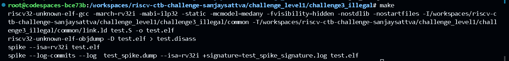

The code is looping endlessly because the trap handler, mtvec_handler, is not properly handling the exception. The issue lies in the mret instruction within the trap handler. 

When an exception is taken, and the mret instruction is executed, it returns control to the address stored in the mepc register, which is the program counter at the time of the trap.

Hence , we have to increment the mpec register so that it points to the next instruction after the illegal instruction.

The illegal instruction " .word 0 " takes the code to the handler and the routine is executed.

The changes I made:

I incremented it to 8 , because the next instruction simply jumps to fail . We dont need that , so we are skipping that

Result:

