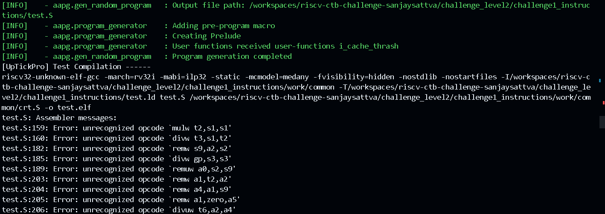
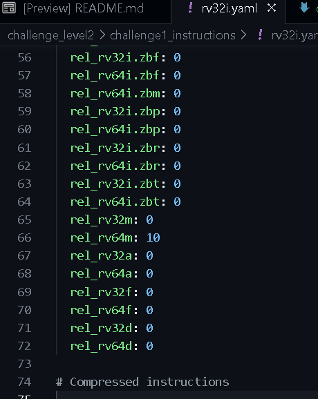
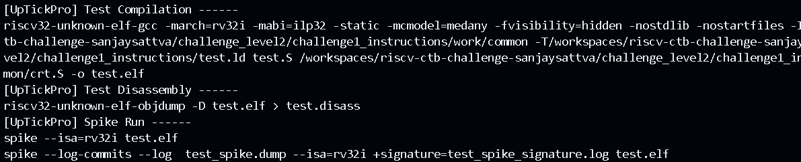

The problem in this case is :

These instructions are 64m ones. That means aapg is generating 64m instructions while spike checks only for rv32i.

Hence I made this change:

to..

this:

the output:

