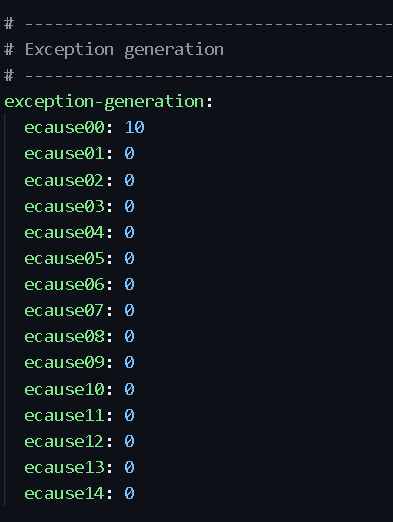
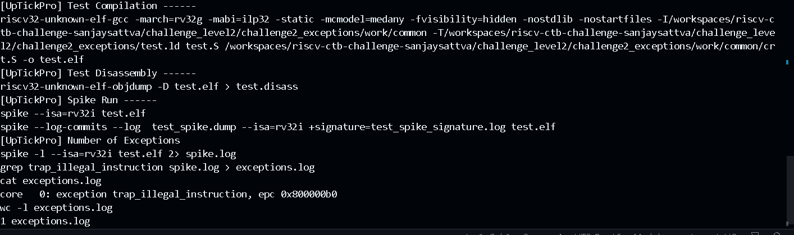

The bug is that : The exception section in the .yaml file didnt have a positive value for the section corressponding to illegal instructions.

Hence , I chnaged the section ecause00 from 0 to 10

The below is the result of test generation.

